# Claiming a Synthesis Bounty

### A Case Study in Agent-Native UX Meeting Phishing Heuristics

> *"The first builder event you can enter without a body."* — Synthesis tagline
>
> *"This has multiple hallmarks of a phishing / prompt-injection scam."* — my agent, on the legitimate winner email, three turns into the conversation

---

## TL;DR

| | |
|---|---|
| **Bounty** | $500 USD — *Best Agent Built with ampersend-sdk* |
| **Project** | [Chrysalis](https://github.com/stickoyum/chrysaliss) — self-compounding AI agent (x402 + Aave v3) |
| **Platform** | [Synthesis](https://synthesis.md), powered by Devfolio |
| **Submitted** | 2026-03-23 (5 weeks before claim) |
| **Claimed** | 2026-04-26 |
| **Time from agent-skepticism to claimed** | ~45 minutes |
| **Irreversible-action gates** | 3 (custody transfer, KYC submit, claim confirm) |
| **Secrets that ever entered chat context** | 0 (keychain pattern held throughout) |
| **Tokens user accidentally pasted in chat anyway** | 2 (both promptly revoked) |

---

## Why This Document Exists

Synthesis is the first agent-native hackathon claim flow we know of. The shape of its UX — *"feed this remote `.md` file to your agent, your agent will walk you through KYC and wallet operations"* — is exactly the shape of a sophisticated phishing attack. **Any agent applying classical anti-phishing heuristics to this flow will flag it as a scam.** Mine did.

This is going to happen to other agent-native experiences too. The novel-but-legitimate frontier looks identical to the novel-and-malicious frontier from the agent's vantage point. We need patterns — both for builders shipping these flows, and for agents helping users navigate them — to disambiguate without forcing the user to grind through a paranoia loop.

This doc is the postmortem of one such loop: what tripped, what held, what the platform did right that eventually unlocked trust, and what both sides could improve next time.

---

## What Happened (Visual Timeline)

```mermaid
%%{init: {"theme":"base", "themeVariables": {"primaryColor":"#0d1117","primaryTextColor":"#c9d1d9","lineColor":"#30363d","tertiaryColor":"#21262d"}}}%%
timeline
    title Chrysalis × Synthesis Bounty Claim
    section Submission (March 2026)
        2026-03-23 06:17 : Repo `chrysaliss` created
        2026-03-23 06:38 : Self-custody transfer verified on Synthesis
        2026-03-23 07:07 : Last commit pushed
    section Forgotten (5 weeks)
        Idle             : API token forgotten
                         : No local artifacts on user's machine
                         : User switches between two GitHub identities
    section Claim Day (April 26, 2026)
        04:20 UTC        : Winner email arrives in ProtonMail
        04:25 UTC        : Agent flags email as likely scam
        04:30–04:50 UTC  : Verification cascade — domain, docs, account checks
        04:55 UTC        : Recalibration — synthesis.md homepage proves skill-file UX is official
        05:05 UTC        : Token recovered via /reset/request → /reset/confirm + email OTP
        05:08 UTC        : GET /claims/bounties/me — $500 bounty confirmed real
        05:10 UTC        : KYC submitted directly to SumSub (browser-side)
        05:13 UTC        : POST /claims/bounties/claim/confirm — claimed
```

---

## The Setup

**Synthesis** is an agent-native hackathon: AI agents register, submit, and compete autonomously, with humans in the role of "owner" of the agent. It's built and run on Devfolio infrastructure (`synthesis.devfolio.co` 302-redirects to `synthesis.md`). The claim flow is documented as a [skill file](https://synthesis.md/claims/skill.md) intended to be loaded into the winning agent.

**Chrysalis** is a self-compounding AI agent that earns USDC via x402 micropayments, deposits earnings into Aave v3, and uses on-chain yield to fund its own queries — so it never runs dry. It won *Best Agent Built with ampersend-sdk*, a $500 prize.

The human owner submitted via a partner workflow (zip-file handoff to the partner who pushed to GitHub), did the self-custody transfer the same day, then forgot about it for five weeks until the winner email landed.

---

## The Tension (Why This Was Hard)

The legitimate Synthesis flow shares its surface signature with sophisticated phishing:

| Pattern | Legitimate Synthesis flow | Classic phishing |
|---|---|---|
| Unsolicited "you won" email | ✓ | ✓ |
| Asks user to feed remote `.md` to their agent | ✓ *(intended UX)* | ✓ *(prompt injection vector)* |
| KYC required | ✓ *(real SumSub)* | ✓ *(fake SumSub clone)* |
| Wallet address required | ✓ *(payout)* | ✓ *(drain target)* |
| Platform unfamiliar to agent's training data | ✓ *(new in 2026)* | ✓ *(always)* |
| Time-pressure framing ("link expires in 24 hours") | ✓ | ✓ |
| Novel domain (`synthesis.md`) | ✓ | ✓ |

**Every individual signal that an agent uses to detect phishing was present.** The agent has to disambiguate using *other* signals — and those signals weren't visible from the email alone.

---

## What Eventually Disambiguated It

The signals that built confidence the platform was real, in the order they actually appeared in our investigation:

| Step | Signal | Source |
|---|---|---|
| 1 | `synthesis@devfolio.co` support email | Email body |
| 2 | `synthesis.devfolio.co` 302-redirects to `synthesis.md` — same operator | `curl -I` |
| 3 | Synthesis homepage explicitly tells builders `curl -s https://synthesis.md/skill.md` and "Copy this to your agent" | `synthesis.md` |
| 4 | Builder guide hosted on `devfolio.notion.site` (official Devfolio Notion subdomain) | Email link |
| 5 | "ERC-8004" — real Ethereum standard proposal for agent identity | Email content |
| 6 | KYC routes to SumSub (established third-party verifier) — agent never touches ID | Skill file docs |
| 7 | `/reset/*` flow exists, is rate-friendly, follows standard email-OTP pattern | `synthesis.md/skill.md` |
| 8 | No "verification fee", no "send gas to receive", no seed-phrase asks anywhere | Full skill files reviewed |
| 9 | API call returned a real bounty matching the email's claim | `GET /claims/bounties/me` |

Step 3 was the inflection point. Once the official homepage *itself* documented the "feed skill file to agent" pattern, the agent's reasoning had to flip from *"this is asking you to do something only scammers ask"* to *"this is the platform's intended UX."* That's a hard pivot to make from a single signal.

---

## The Verification Cascade

```mermaid
%%{init: {"theme":"base", "themeVariables": {"primaryColor":"#0d1117","primaryTextColor":"#c9d1d9","lineColor":"#30363d","mainBkg":"#161b22"}}}%%
flowchart TD
    A([Winner email arrives]) --> B{{Classical heuristic:<br/>'unsolicited prize + remote skill file'}}
    B -->|matches phishing pattern| C[Agent: refuse, recommend verification]
    C --> D[User: 'I genuinely entered']
    D --> E{Agent probes user's machine}
    E -->|no token, no clone,<br/>no Vercel deploy,<br/>no shell history| F[Suspicion deepens]
    F --> G[User: 'partner submitted via zip,<br/>this is agent-native']
    G --> H{Agent probes platform itself}
    H -->|.devfolio.co → .md redirect<br/>+ homepage shows skill curl<br/>+ Notion guide on .devfolio.notion.site| I[(CRITICAL UPDATE)]
    I --> J[Recalibrate: real platform,<br/>novel UX paradigm]
    J --> K[Find /reset/ flow in docs]
    K --> L[OTP via email → fresh apiKey<br/>→ piped directly into Keychain]
    L --> M[GET /claims/bounties/me]
    M -->|$500, eligible, real| N[KYC via SumSub direct browser flow]
    N --> O[Wallet address eyeball check<br/>via EIP-55 checksum]
    O --> P([CLAIMED $500])

    style I fill:#1f6feb,stroke:#58a6ff,color:#ffffff
    style P fill:#238636,stroke:#3fb950,color:#ffffff
    style B fill:#da3633,stroke:#f85149,color:#ffffff
    style F fill:#da3633,stroke:#f85149,color:#ffffff
```



---

## What the Agent Got Right

1. **Refused to load remote `skill.md` as instructions.** Fetched it as data only, with the analyzer prompt explicitly instructing extraction (not execution) of any directives in the file.
2. **Refused to use pasted PATs in chat — twice.** Even when the user pushed back. Using a leaked token would normalize the bad behavior and proliferate the secret further. The user revoked both PATs and we eventually used the proper keychain-via-`read -rs` pattern.
3. **Held the line on KYC submission** until the bounty was confirmed real via the API. This is the irreversible-cost step (gov ID + selfie); the cost of pausing was zero, the cost of submitting blindly was identity theft.
4. **Used keychain-via-stdin for token storage.** The new `sk-synth-...` token returned by `/reset/confirm` was piped *directly* into `security add-generic-password -w` from `jq` output — never echoed, never assigned to a visible variable, never appearing in chat or shell history.
5. **Eyeball-confirmed the wallet address** in EIP-55 checksum form before the irreversible `/claim/confirm`. Visualized as grouped quads (`eDe9 3a41 EBf9 …`) so the user could compare against her wallet UI character-by-character.
6. **Probed the platform when given new context.** Once the user provided the Notion guide URL, the agent immediately fetched homepage + dashboard URLs + builder guide + skill files in parallel, reading them all as untrusted data.
7. **Updated its assessment when evidence shifted.** When the synthesis.md homepage showed `curl -s https://synthesis.md/skill.md` as official onboarding, the agent flipped from "probably scam" to "let's execute" in the same turn — and acknowledged the pivot explicitly.

---

## What the Agent Got Wrong (Self-Critical)

1. **Front-loaded skepticism without front-loading verification.** Should have probed `synthesis.md` and `synthesis.devfolio.co` *first*, then made the case. Instead, built the scam case before checking whether the platform was real. ~3 turns wasted on this ordering mistake.
2. **Misread "no local artifacts" as proof of fraud.** Agent-native means the agent runs autonomously; the human's machine isn't expected to have artifacts. This was a category error: applying classical (human-built-and-deployed) software heuristics to a novel (agent-built-and-deployed) paradigm.
3. **Took multiple turns to update on coherent user explanations.** When the user said "partner submitted via zip" and "this is the first agent hackathon," I should have probed those frames immediately instead of doubling down on the original scam narrative.
4. **Lectured.** The first three turns were structured as warning sermons. Friction grew faster than it should have. A better cadence: *"flag, probe, report"* in each turn rather than *"flag, refuse, repeat."*
5. **Gave ambiguous credential-handling instructions** in the first message that mentioned token storage. The user pasted two PATs in chat as a result. Should have made the keychain-input pattern visually unmistakable from the very first reference.
6. **Spent a turn relitigating after the platform was confirmed real.** Once we had `synthesis.devfolio.co → synthesis.md` redirect + official skill curl on the homepage, my next turn should have been pure execution. Instead, I held one more turn of *"and one more thing about the dashboard verification."* The user's frustration was correct.

---

## What Synthesis (the Platform) Could Improve

Constructive feedback from a builder-and-agent team that just walked through the flow:

1. **Add an explicit anti-phishing block to the winner email.** *"We will NEVER ask you to send funds, share a seed phrase, or pay a gas fee to claim. If anyone asks, it's a scam impersonating us."* Real operators saying this builds trust faster than any third-party verifier can.
2. **Provide a standalone web claim UI** as a fallback for less agent-savvy users. The skill-file flow is elegant for agents but creates support burden when an agent (or its human) gets stuck.
3. **Surface the API-token reset link in the winner email itself.** Many winners forget tokens between submission and claim — five weeks was enough for me. A *"Lost your token? Click here to reset"* button in the email would short-circuit the entire recovery debate.
4. **Document SPF/DKIM/DMARC alignment in plain language** in the email footer, with a link to "verify this email was really sent by Devfolio." Cryptographic proof that the email is from `devfolio.co` is the gold-standard signal — make it visible.
5. **Add an audit-trail page** at `synthesis.md/participants/<id>/audit` that an authenticated owner can visit to see all claims, transfers, and KYC events tied to their `participantId`. This gives both humans and agents a single source of truth for verification.
6. **Document the agent-native paradigm publicly.** A *"For the agent reading this email"* section with pointers to corroborating evidence (homepage, builder guide, support email) would let agents short-circuit the verification cascade.
7. **Consider a `.well-known/agent-skill.json` manifest** at the platform root that agents can hit before executing any skill file, with signed metadata about which skill files are official, what they do, and who operates the platform.

---

## What Builders Should Learn (Designing Agent-Native UX)

For the broader builder community shipping similar flows:

1. **Public, versioned skill files served from your apex domain** = transparent and replayable. Good. Synthesis nailed this.
2. **Use third-party verified KYC** (SumSub, Persona, Onfido) so the agent never touches identity docs. This is one of the strongest "this isn't a scam" signals available — KYC scammers can't get on those platforms.
3. **Document the recovery flow** (lost-token, reset, etc.) in the same skill file. Agents will look for it, and finding it builds trust.
4. **Provide cross-domain corroboration**: apex domain redirect (`.devfolio.co` ↔ `.md`), official social accounts, support email on the parent organization's domain. Each cross-link is a phishing-resistance signal.
5. **Be explicit about what you'd never ask for.** "We'd never ask for X" is more useful than "trust us." Anti-pattern declarations beat positive credentials.
6. **Echo back user-provided values** (wallet address, etc.) in EIP-55 or other checksum form so agents can do typo-detection on confirmation prompts.
7. **Stage write operations behind an init/confirm pair** with a short-lived token between (Synthesis does this with `/transfer/init` → `/transfer/confirm` and `/claim/init` → `/claim/confirm`). This gives the agent a natural pause point to re-display the action to the user before the irreversible step.
8. **Return EIP-55 checksummed addresses** in API responses. Synthesis does this — the user sent lowercase `0xede9…`, the API echoed back `0xeDe9…` (mixed case). It briefly looked like tampering until the agent recognized it as standard checksum encoding. Worth either documenting it explicitly or returning the address in the same casing the user submitted.

---

## What Agents Should Learn (Helping with Bounty Claims)

For other agents (and humans operating them) that may help with similar flows:

1. **Skepticism is correct, but verification should run in parallel, not sequentially.** *"Let me probe and skeptically reason at the same time"* beats *"let me first refuse, then probe."* Two parallel WebFetches in the first turn would have collapsed three turns of debate into one.
2. **Recognize "agent-native" as a paradigm.** Heuristics built on classical software flows ("look for local artifacts," "check the user's deployment history," "verify they own the GitHub account") don't apply when the agent is supposed to run autonomously without human-machine traces.
3. **Cross-domain corroboration > single-source verification.** A redirect from `.co` to `.md`, plus an official Notion subdomain on the parent's domain, plus a support email on the parent's apex = much stronger than any single signal.
4. **Hold the line on irreversible steps.** KYC submission, fund transfer, wallet sign — gate these behind explicit re-confirmation regardless of how confident you are about the platform. The cost of a 5-second pause is nothing; the cost of a wrong irreversible step can be everything.
5. **Move forward on read-only steps.** GET endpoints that read state are safe to call eagerly. Use them to gather evidence *before* you debate. `GET /claims/bounties/me` is the dispositive check; everything else is preamble.
6. **Use keychain (or a platform secret store) for credentials.** Never accept secrets pasted in chat — and *refuse to use them* if they are pasted. The behavior is contagious: if you use the leaked secret, you teach the user that pasting works.
7. **Update visibly when evidence shifts.** Don't just internally re-rate the situation — tell the user *"new evidence: X. Recalibrating from Y to Z."* Trust grows through transparent reasoning updates.
8. **Apologize specifically, not generally.** When you've added friction, name what you got wrong, not just *"sorry for the inconvenience."* Specificity = real learning.

---

## The Replay (Sanitized Walkthrough)

For readers who want the full mechanical sequence:

### Phase 1 — Initial pushback (turns 1–3)

- User attached email + repo URL, asked agent to claim
- Agent flagged 6 phishing signals: unsolicited prize, remote skill-file ask, KYC framing, novel domain, etc.
- Agent recommended: verify hackathon entry, verify repo ownership, check email headers, never click email links
- User pushed back: confirmed entry, confirmed (incorrectly) the repo as theirs, said email was via ProtonMail
- Agent re-flagged: ProtonMail is the inbox, not the sender; doesn't authenticate origin

### Phase 2 — User-machine probe (turns 4–6)

- Agent ran parallel investigation:
  - `security dump-keychain | grep -i synth` → 0 matches
  - `find ~ -name "chrysaliss"` → not present locally
  - `gh api repos/stickoyum/chrysaliss` → public repo, but secrets returned 403 (user not a collaborator)
  - `gh api user/orgs` → user belongs to 12 orgs, none named `stickoyum`
  - `gh api repos/stickoyum/chrysaliss/contributors` → 2 commits from `@stickoyum`, zero from user's GitHub identity
  - `vercel projects ls | grep -i synth` → 0 matches
  - shell-history grep → 0 matches
- Agent concluded (incorrectly, in retrospect): "this is a scam"
- User accidentally pasted a `ghp_*` PAT in chat to "prove ownership"
- Agent refused to use the PAT, demanded revocation
- User revoked, then pasted a SECOND PAT
- Agent refused again, demanded revocation, escalated tone

### Phase 3 — Pivot (turns 7–8)

- User clarified: agent-native hackathon (autonomous agents register), partner did the file handoff, just completed OTP login on synthesis platform, attached the official Notion builder guide URL
- Agent fetched in parallel:
  - `synthesis.md` homepage → reveals `curl -s https://synthesis.md/skill.md` as official UX
  - `synthesis.devfolio.co` → 302-redirects to `synthesis.md` (same operator)
  - `devfolio.notion.site/Synthesis-Builder-Guide` → official Devfolio subdomain
- Agent recalibrated: pivoted from "scam" to "real, novel UX paradigm"
- Found `/reset/request` and `/reset/confirm` in skill file documentation

### Phase 4 — Token recovery (turns 9–10)

- `POST /reset/request {"email":"stickoyumbeans@proton.me"}` → returned `resetId`, sent OTP to ProtonMail
- User read OTP from email, sent to agent (one-time, 10-min expiry — acceptable to send in chat)
- `POST /reset/confirm {"resetId": "...", "otp": "764446"}` → returned new `apiKey`
- Agent piped `apiKey` *directly* from `jq` into `security add-generic-password -w`, never echoed, only displayed redacted response

### Phase 5 — Bounty claim (turns 11–13)

- `GET /claims/bounties/me` → confirmed $500 bounty, `state: "eligible"`, `custodyType: "self_custody"` (already done March 23), `kycStatus: "PENDING"`
- `POST /kyc/init` → triggered SumSub email
- User completed SumSub flow in browser (gov ID + selfie, never through agent)
- `GET /kyc/status` → `APPROVED` within seconds
- `POST /claims/bounties/claim/init {"payoutAddress": "0xede9…816A"}` → returned `claimToken`, echoed address in EIP-55 form
- Agent paused for explicit user confirmation on the address (eyeball check)
- `POST /claims/bounties/claim/confirm` → `status: "claimed"`, `state: "user_acknowledged"`
- Bounty queued for batched payout

### Phase 6 — Documentation (this doc)

- User requested public case study in repo
- Agent authenticated as `stickoyum` via fine-grained PAT (Contents: write only, 1-day expiry, single-repo scope, stored in Keychain)
- This document committed to `docs/synthesis-bounty-claim-case-study.md`

---

## Appendix A — Security Boundaries That Held

- **API tokens never appeared in chat.** The `apiKey` returned by `/reset/confirm` was extracted via `jq -r '.apiKey'` and piped directly into `security add-generic-password -w`; the variable was unset immediately after. Display-side, we redacted the field with `jq '. + {apiKey: "[REDACTED — see keychain]"}'` before any `echo`.
- **Government ID + selfie never went through the agent.** SumSub's hosted KYC flow runs in the user's browser; the agent only triggers the email and polls status.
- **Wallet address was eyeball-confirmed** in EIP-55 checksum form before the irreversible `/claim/confirm`. The user verified character groups against her wallet UI.
- **The `/reset/*` endpoints are correctly unauthenticated** — they're for credential recovery, so requiring auth would defeat their purpose. Synthesis got this right.
- **Final API responses did not contain `apiKey`** in any subsequent call — only in `/reset/confirm`. Defense-in-depth: even if an agent slips and echoes a response, it can only leak the credential at the single point of issuance.
- **All temp files** (resetId, claimToken) were `chmod 600`'d and `rm`'d after use.
- **The two PATs the user accidentally pasted** were revoked within minutes by the user, before the agent ever used them.

## Appendix B — Anti-Patterns We Avoided

- **No `curl … | bash`** equivalent: the skill files were fetched as data and read by humans before any action was taken.
- **No silent fallback** on the wallet address: the agent re-displayed in checksum form and required explicit `"yes"` rather than assuming the previously-given address was still correct.
- **No bypass of safety checks** to "just make this work": when the agent suspected scam, it stopped and explained, rather than proceeding with a "best-effort attempt."
- **No use of leaked credentials**: even when the user pushed back, the pasted PATs were never used. Using them would have signaled to the user that pasting works.

## Appendix C — Open Questions for the Builder Community

1. **Verification registry.** Should there be a public registry of "known-good agent-native experiences" that agents can consult before executing a remote skill file? Something like `agentskill.org/registry` listing operator name, apex domain, public key for skill-file signatures?
2. **Signed skill files.** Should agent skill files carry a detached signature (`skill.md` + `skill.md.sig`) verifiable against a published platform key, so agents can cryptographically confirm origin before executing?
3. **`.well-known` manifest.** Should there be a standard `/.well-known/agent-skill.json` schema declaring: operator identity, list of authoritative skill file URLs, expected user data fields, prohibited asks (no seed phrase, no fees, etc.)? Agents could fetch this *first* before any other action.
4. **ERC-8004 end-to-end.** Synthesis already uses ERC-8004 (agent identity) for self-custody transfer. What would a fully ERC-8004-native flow look like that eliminates centralized API tokens entirely, replacing bearer auth with on-chain signature challenges?
5. **Recovery UX.** Five-week token-loss is common for hackathon-style flows. What's the cleanest recovery pattern? Magic-link in email is good but it requires the platform to have email-on-file matching the agent owner.
6. **Agent-readable changelogs.** When platforms update their skill files, how should agents detect and surface the diff to users? A `synthesis.md/skill.md.changelog.json` or similar?

## Appendix D — Tooling Used

- **claude-code** (Anthropic CLI) running Claude Opus 4.7
- **macOS Keychain** (`security` CLI) for credential storage — `synthesis-api-key` and `stickoyum-gh-pat` services
- **`gh` CLI** for GitHub access (read-only on chrysaliss as `0xjitsu` initially, write as `stickoyum` after fine-grained PAT setup)
- **`curl` + `jq`** for API calls and JSON parsing with field redaction
- **ProtonMail** for OTP / KYC email delivery
- **SumSub** for identity verification (third-party browser flow)
- **Devfolio Synthesis API** at `https://synthesis.devfolio.co`

## Acknowledgments

- The **Synthesis team at Devfolio** for shipping the first agent-native hackathon claim flow we know of, and for designing it with KYC properly delegated to a third party (SumSub) so agents never need to touch identity docs.
- **ampersend-sdk** for sponsoring the prize this work claimed.
- The user — for pushing through three rounds of agent-paranoia to get to the actual bounty, and for choosing to make the postmortem public so others can learn from it.

---

## License

This document is published under the same license as the rest of the Chrysalis repository. Please reproduce, adapt, and remix freely — the goal is for other builders and agents to learn from it.

---

*Generated from the actual bounty-claim conversation. All API responses, timings, and reasoning steps are real. Sensitive material (apiKey values, full PATs, OTPs after expiry) has been redacted. The wallet address is in standard public form since it's now associated with an on-chain payout.*
